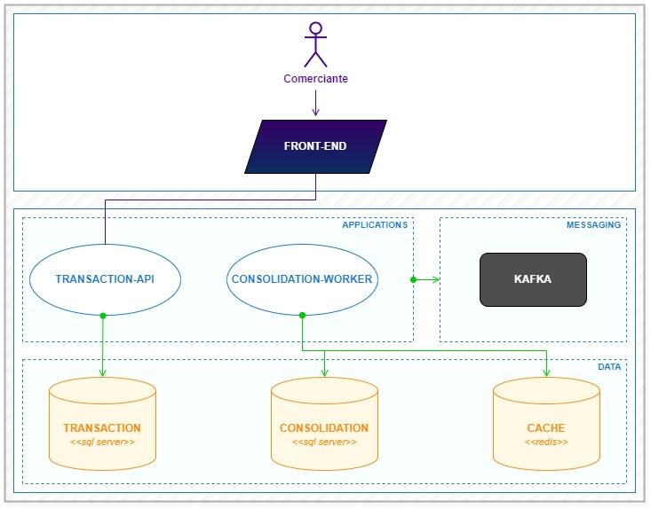

## Motivação

Um comerciante precisa de uma maneira eficiente para acompanhar o fluxo de caixa diário. Para isso, ele quer registrar todos os lançamentos de débitos e créditos que acontecem ao longo do dia. Além de registrar essas transações, ele também precisa de um relatório que mostre o saldo consolidado no final do dia, facilitando o controle financeiro.

## Domínios funcionais e capacidades de negócio

Esses são os principais domínios do sistema e suas capacidades, que ajudam o comerciante a gerenciar melhor suas finanças diárias.

### Gestão financeira

**Descrição:**  
É responsável por registrar os lançamentos financeiros, tanto créditos quanto débitos. Cada lançamento representa uma transação financeira realizada pelo comerciante.

**Capacidades de negócio:**

- **Registro de lançamentos:**  
  - Permitir que o comerciante registre um novo lançamento financeiro, especificando a data, valor, tipo de lançamento (crédito ou débito), e uma descrição.
  - Validar os dados de entrada para garantir que valores numéricos sejam positivos e que o tipo de lançamento seja corretamente identificado.

- **Visualizar todos os lançamentos:**  
  - Permitir ao comerciante visualizar a lista completa de todos os lançamentos financeiros realizados.
  - A lista de lançamentos deve ser paginada para melhorar a performance e facilitar a navegação.

- **Visualizar lançamento específico:**  
  - Permitir ao comerciante visualizar os detalhes de um lançamento específico ao fornecer o Id do lançamento.
  - Validar a existência do Id fornecido e retornar uma mensagem adequada caso o lançamento não seja encontrado.

### Consolidação de transações

**Descrição:**  
Calcula e disponibiliza o saldo diário consolidado com base nos lançamentos financeiros registrados. Isso ajuda o comerciante a entender a posição financeira ao longo do dia.

**Capacidades de negócio:**

- **Cálculo do saldo diário:**  
  - Atualizar automaticamente o saldo diário sempre que uma nova transação é registrada.
  - Somar todos os créditos e subtrair todos os débitos registrados até o momento para calcular o saldo.

## Desenho da solução

Para gerenciar de forma eficiente as transações financeiras e a consolidação de dados, o sistema foi estruturado com componentes interligados. O diagrama abaixo, elaborado usando o [MDL (Minimalist Development Language Specification)](https://mdlmodel.com), ilustra a arquitetura e a interação entre as diferentes partes do sistema:

### Componentes da Arquitetura

#### Comerciante
O `comerciante` é o usuário final do sistema, responsável por realizar operações financeiras, como inserção de transações de débito e crédito. Este usuário também consulta relatórios para monitorar o saldo diário consolidado.

#### Front-End
O `Front-End` é a interface com o usuário, permitindo ao comerciante interagir com o sistema. A interface pode ser uma aplicação web ou móvel, facilitando a inserção de transações e a visualização de relatórios de saldo.

#### Applications

- **Transaction-API**
  - Este é um serviço de API que recebe e processa as transações financeiras realizadas pelo comerciante.
  - As transações são salvas no banco de dados `Transaction`, implementado em SQL Server.
  - Após o registro de uma transação, uma mensagem é publicada no Kafka para que outros serviços possam processar a transação.
  - Também oferece endpoints para listar todas as transações, facilitando a visualização de um histórico completo das operações financeiras.
  - Além disso, há endpoints que permitem obter detalhes de uma transação específica por meio do seu Id, proporcionando acesso fácil e direto a informações específicas de transações.

- **Consolidation-Worker**
  - Este serviço consome mensagens do Kafka sobre novas transações.
  - Ele processa as transações para realizar a consolidação do saldo diário. Durante esse processo, o `Consolidation-Worker` calcula o saldo consolidado com base nas transações recebidas.
  - Para melhorar a eficiência e reduzir a carga de consultas no SQL Server, o saldo consolidado diário é armazenado no Redis. Isso permite acesso rápido aos dados de saldo consolidado sem a necessidade de consultas constantes ao banco de dados SQL Server.
  - Os resultados consolidados são armazenados no banco de dados `Consolidation` para persistência a longo prazo.

#### Messaging

- **Kafka**
  - É usado para facilitar a comunicação assíncrona entre os serviços `Transaction-API` e `Consolidation-Worker`.
  - Ele recebe mensagens sobre novas transações na `Transaction-API`e as disponibiliza para o `Consolidation-Worker` processar.

#### Data

- **Transaction**: banco de dados SQL Server que armazena as transações financeiras realizadas pelo comerciante.

- **Consolidation**: banco de dados SQL Server onde os dados consolidados do saldo diário são armazenados, após o processamento pelo `Consolidation-Worker`.

- **Cache**: Redis é utilizado como um cache para armazenar dados frequentemente acessados, como resultados de consultas de saldo ou transações recentes, melhorando a performance da aplicação.

### Benefícios da arquitetura

A arquitetura adotada neste projeto foi cuidadosamente planejada para garantir desempenho, escalabilidade e manutenção eficiente dos componentes. Abaixo estão os motivos que justificam a escolha de cada componente na solução:

- **Desacoplamento através do Kafka**:  
  O uso do Kafka como sistema de mensageria permite que os componentes da arquitetura sejam desacoplados. Isso significa que a Transaction-API e o Consolidation-Worker podem funcionar de forma independente, processando mensagens conforme necessário. Essa independência facilita a escalabilidade e a manutenção, pois cada componente pode ser atualizado ou escalado sem impactar diretamente os outros. Além disso, o Kafka permite um processamento assíncrono das transações, garantindo que as operações críticas não sejam interrompidas.

- **Escalabilidade**:  
  A arquitetura foi projetada para permitir a escalabilidade independente de cada componente. Por exemplo, se a demanda por processamento de transações aumentar, apenas o Consolidation-Worker pode ser escalado horizontalmente para lidar com o aumento de carga. Da mesma forma, a Transaction-API pode ser escalada para gerenciar um maior número de requisições do front-end. Essa flexibilidade é essencial para garantir que o sistema possa crescer conforme a necessidade.

- **Eficiência com Redis como cache**:  
  O Redis é utilizado como uma camada de cache para armazenar temporariamente os dados consolidados. Essa abordagem reduz a latência nas respostas de consultas frequentes, proporcionando uma experiência de usuário mais ágil e responsiva. O cache também diminui a carga no banco de dados SQL Server, melhorando o desempenho geral do sistema.

- **Persistência segura com SQL Server**:  
  O uso do SQL Server como banco de dados relacional garante que os dados financeiros sejam armazenados de forma segura e confiável. O SQL Server oferece recursos avançados de transações e integridade referencial, que são fundamentais para garantir a consistência dos dados. Para isso, o projeto é divido em duas instâncias: 
  - **Transaction**: Responsável pelo armazenamento dos dados transacionais. Esta instância é otimizada para operações de escrita, garantindo que todas as transações sejam registradas com precisão.
  - **Consolidation**: Focado no armazenamento de dados consolidados para relatórios. Essa separação permite que consultas de relatório sejam otimizadas sem impactar o desempenho das transações diárias.
  
  Dessa forma, a arquitetura permite a flexibilidade de usar dois servidores de banco de dados distintos para as instâncias de `Transaction` e `Consolidation`. Essa abordagem pode ser vantajosa para distribuir a carga de trabalho e otimizar ainda mais o desempenho e a segurança dos dados.

- **Separação de bancos para dados transacionais e de relatório**:  
  A decisão de usar bancos de dados separados para transações e consolidação (relatórios) foi tomada para melhorar o desempenho e a organização dos dados. O banco de dados de transações é altamente transacional, lidando com inserções frequentes e garantindo que os dados sejam capturados com rapidez. Já o banco de dados de consolidação é otimizado para consultas de leitura, permitindo que relatórios sejam gerados de forma eficiente e sem afetar o desempenho das operações transacionais.

Essa arquitetura robusta e bem definida garante que o sistema possa lidar com grandes volumes de dados de maneira eficiente, mantendo a flexibilidade necessária para adaptação futura.

## Estrutura do repositório

O repositório é organizado para facilitar o desenvolvimento e a implantação dos componentes do sistema. 

- **Docker-Compose**: O repositório inclui um arquivo [`docker-compose.yml`](./docker-compose.yml) que configura e executa os serviços necessários, incluindo Kafka, Redis, SQL Server, Transaction-API e Consolidation-Worker.

### Código-fonte

- **transaction-api**:  
  A pasta [`transaction-api`](./transaction-api) contém o código-fonte da API responsável por gerenciar os lançamentos financeiros. 

- **consolidation-worker**:  
  A pasta [`consolidation-worker`](./consolidation-worker) contém o código-fonte do worker responsável por consolidar as transações e calcular o saldo diário.

Em cada uma dessas pastas, há um arquivo README que fornece instruções detalhadas sobre a configuração, execução e uso das respectivas aplicações. Além disso, existe uma pasta `docs` que contém as especificações técnicas e diagramas de sequência, proporcionando uma compreensão mais aprofundada de cada aplicação.