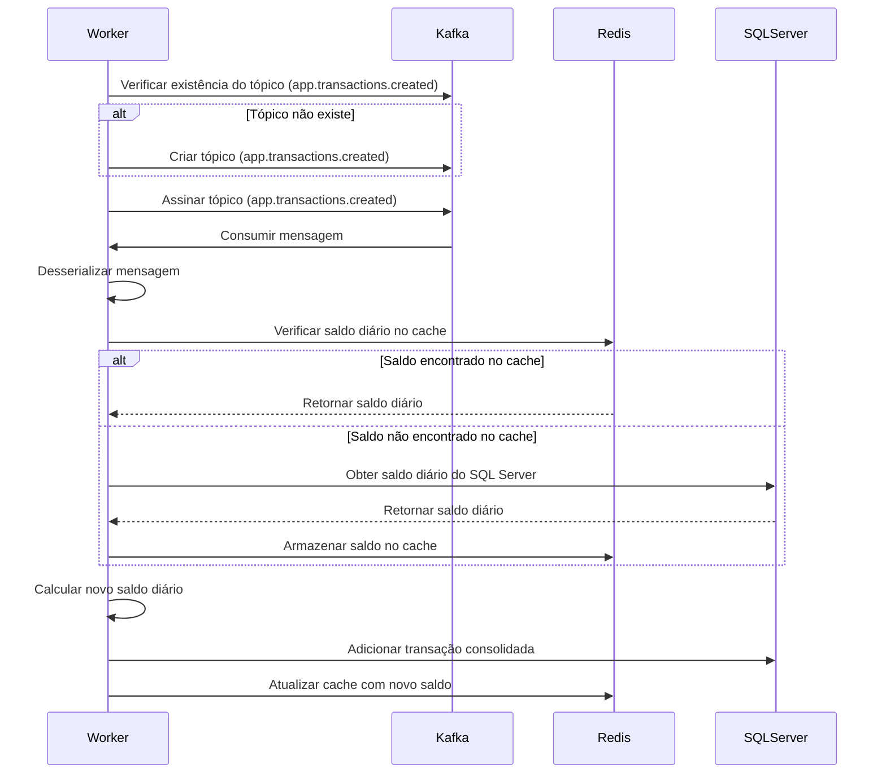

# Arquitetura do projeto

O `Consolidation-Worker` foi desenvolvido para processar e consolidar dados de transações financeiras de maneira eficiente. Este projeto segue uma arquitetura modular para facilitar a manutenção e a escalabilidade. Abaixo, a descrição de cada camada do projeto:

- **Consolidations.Worker**:  
  Este é o núcleo do serviço, responsável por processar as mensagens recebidas do Kafka, consolidar as transações financeiras e atualizar o saldo diário no banco de dados. Atua como um serviço de background que executa essas tarefas de forma contínua.

- **Consolidations.Domain**:  
  Contém as entidades de domínio e define a lógica central de negócio para a consolidação de transações. Esta camada é responsável por encapsular as regras de como os dados financeiros são processados e armazenados.

- **Consolidations.Infrastructure.Core**:  
  Fornece interfaces e abstrações básicas utilizadas pelas demais camadas da aplicação. Esta camada define contratos e padrões que são implementados em outras partes do sistema, promovendo a reutilização e facilitando a integração.

- **Consolidations.Infrastructure.Data**:  
  Inclui a implementação de repositórios e o acesso ao banco de dados, utilizando o Entity Framework Core. Esta camada gerencia a persistência dos dados de consolidação no banco de dados SQL Server, garantindo que os saldos consolidados sejam atualizados corretamente.

- **Consolidations.Infrastructure.CrossCutting.Redis**:  
  Implementa a interação com o Redis para cache, que é utilizado para armazenar temporariamente os dados consolidados e melhorar o desempenho das operações de leitura. Esta camada lida com a configuração e o gerenciamento das operações de cache.

# Documentação dos dominios funcionais

As especificações técnicas de cada domínio funcional do projeto estão detalhadas nesta seção. Cada diagrama de sequência ilustra os fluxos de comunicação entre os componentes envolvidos em diferentes cenários de interação, mostrando como as operações são executadas.

## Consolidação de transações

Calcula e disponibiliza o saldo diário consolidado com base nos lançamentos financeiros registrados. Isso ajuda o comerciante a entender a posição financeira ao longo do dia.

**Fluxo**:
1. O Worker verifica se o tópico `app.transactions.created` existe no Kafka.
   - Se o tópico não existir, o Worker o cria.
2. O Worker assina o tópico `app.transactions.created` para receber mensagens de transações criadas.
3. Ao receber uma mensagem, o Worker a consome e desserializa os dados.
4. O Worker verifica o saldo diário no cache Redis:
   - Se o saldo for encontrado no cache, ele é retornado ao Worker.
   - Se o saldo não for encontrado, o Worker consulta o SQL Server para obter o saldo diário.
5. O saldo diário obtido é armazenado no cache Redis, caso não estivesse presente.
6. O Worker calcula o novo saldo diário.
7. O Worker adiciona a transação consolidada ao banco de dados SQL Server.
8. O Worker atualiza o cache Redis com o novo saldo diário.

