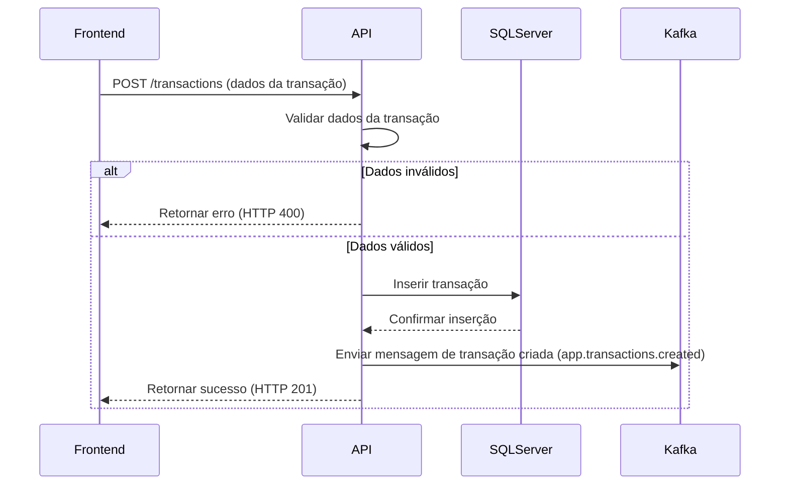
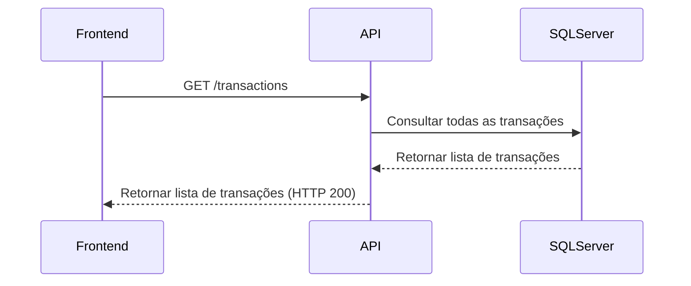
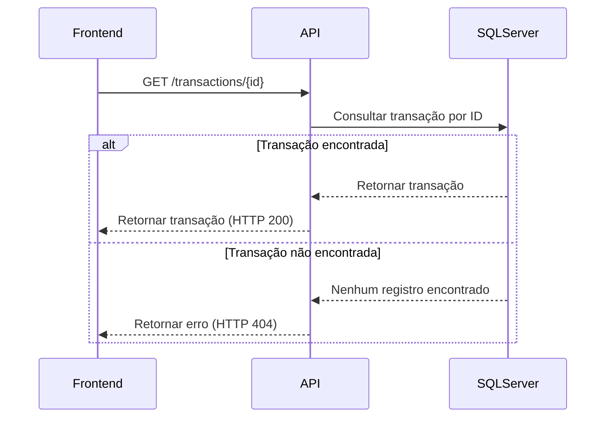

# Arquitetura do projeto

Este projeto foi desenvolvido seguindo o padrão CQRS (Command Query Responsibility Segregation), que separa as operações de escrita (comandos) das operações de leitura (consultas). Isso permite uma melhor organização do código, facilita a manutenção e melhora a escalabilidade. Abaixo, a descrição de cada camada do projeto:

- **Transactions.API**:  
  Esta é a camada de interface com o usuário, onde os endpoints RESTful são expostos para interação externa. Aqui, o ASP.NET Core Web API é utilizado para gerenciar as requisições HTTP e direcioná-las para os serviços apropriados na aplicação.

- **Transactions.Application**:  
  Esta camada contém a lógica de aplicação, implementando os comandos (commands) e consultas (queries) conforme o padrão CQRS. Ela orquestra a interação entre a camada de API e a lógica de domínio, garantindo que as operações sejam direcionadas corretamente e que as respostas sejam retornadas de acordo.

- **Transactions.Domain**:  
  Contém as entidades de domínio, que são representações conceituais das transações e suas propriedades. Esta camada define a estrutura dos dados e encapsula a lógica de domínio específica para manipulação das entidades.

- **Transactions.Infrastructure.Core**:  
  Fornece interfaces e abstrações básicas que são usadas pelas demais camadas da aplicação. Esta camada define contratos para serviços e operações que podem ser implementados por diferentes componentes do sistema, facilitando a reutilização e a integração.

- **Transactions.Infrastructure.Data**:  
  Contém a implementação dos repositórios e o acesso ao banco de dados, como as configurações do Entity Framework Core. Esta camada interage diretamente com o SQL Server para armazenar e recuperar dados das entidades de domínio.

- **Transaction.Infrastructure.CrossCutting.Kafka**:  
  Implementa serviços de comunicação via Kafka, integrando o sistema com o middleware de mensageria. Esta camada cuida da publicação e consumo de mensagens, permitindo que diferentes componentes do sistema se comuniquem de maneira assíncrona.

# Documentação dos dominios funcionais

As especificações técnicas de cada domínio funcional do projeto estão detalhadas nesta seção. Cada diagrama de sequência ilustra os fluxos de comunicação entre os componentes envolvidos em diferentes cenários de interação, mostrando como as operações são executadas.

## 1. Registro de lançamentos

**Descrição**: Permitir que o comerciante registre um novo lançamento financeiro, especificando a data, valor, tipo de lançamento (crédito ou débito), e uma descrição.

**Fluxo**:
1. O front-end faz uma requisição POST para o endpoint `/transactions` na API, enviando os dados da transação.
2. A API valida os dados da transação:
   - Se os dados forem inválidos, a API retorna um erro (HTTP 400).
   - Se os dados forem válidos, a API insere a transação no SQL Server.
3. O SQL Server confirma a inserção da transação.
4. A API envia uma mensagem de transação criada para o Kafka (`app.transactions.created`).
5. A API retorna uma resposta de sucesso ao front-end (HTTP 201).

## 2. Visualizar todos os lançamentos

**Descrição**: Permitir ao comerciante visualizar a lista completa de todos os lançamentos financeiros realizados.

**Fluxo**:
1. O front-end faz uma requisição GET para o endpoint `/transactions` na API.
2. A API consulta o SQL Server para obter todas as transações.
3. O SQL Server retorna a lista de transações para a API.
4. A API retorna a lista de transações para o front-end (HTTP 200).

## 3. Visualizar lançamento específico

**Descrição**: Permitir ao comerciante visualizar os detalhes de um lançamento específico ao fornecer o Id do lançamento.

**Fluxo**:
1. O front-end faz uma requisição GET para o endpoint `/transactions/{id}` na API, onde `{id}` é o identificador da transação.
2. A API consulta o SQL Server para obter a transação pelo ID fornecido.
3. Se a transação for encontrada, o SQL Server retorna a transação para a API.
   - A API retorna a transação para o front-end (HTTP 200).
4. Se a transação não for encontrada, a API retorna um erro ao front-end (HTTP 404).